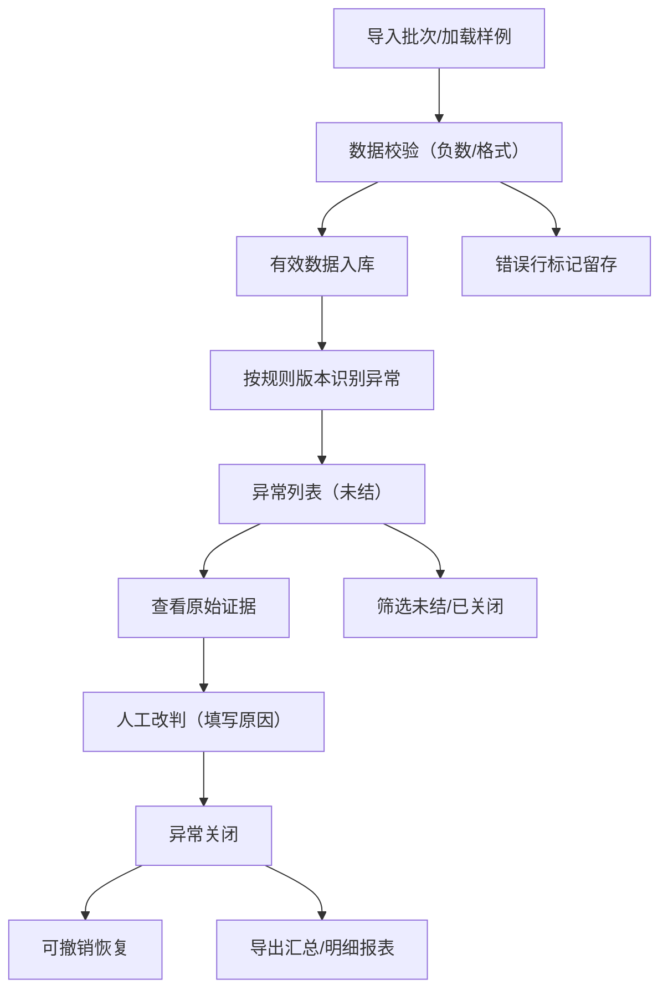

## 1. 产品概述

食堂损耗复核台是面向餐饮企业内部质量管理的本地Web应用，用于对食堂备餐称重数据进行规则化异常识别、人工复核改判和历史追溯。通过自动化识别备餐过量、食材变质等损耗疑点，结合人工判定流程，帮助企业精准统计损耗原因并导出合规报表。

## 2. 核心功能

### 2.1 用户角色
| 角色 | 注册方式 | 核心权限 |
|------|----------|----------|
| 复核管理员 | 本地默认账户 | 导入批次、配置规则、人工改判、导出报表、撤销关闭 |

### 2.2 功能模块
1. **批次列表页**：显示所有导入批次，含导入状态、异常数量、复核进度，支持导入样例数据和新批次
2. **异常复核页**：按批次展示命中异常，支持筛选未结/已关闭，查看原始规则证据，记录人工原因并改判
3. **规则配置页**：配置损耗判定规则（备餐过量阈值、变质怀疑条件），支持版本管理
4. **报表导出页**：选择批次导出汇总报表和明细报表（CSV格式）

### 2.3 页面详情
| 页面名称 | 模块名称 | 功能描述 |
|----------|----------|----------|
| 批次列表页 | 批次卡片列表 | 展示批次ID、日期、导入时间、总记录数、异常数、未结数、状态标签 |
| 批次列表页 | 导入操作区 | 导入CSV文件按钮、导入样例批次按钮、重复导入检测提示 |
| 异常复核页 | 异常筛选栏 | 状态筛选（全部/未结/已关闭）、异常类型筛选、搜索框 |
| 异常复核页 | 异常详情卡片 | 原始称重数据、命中规则版本和证据、人工改判表单（原因、状态） |
| 异常复核页 | 撤销关闭操作 | 已关闭异常可撤销，恢复为未结状态并保留历史记录 |
| 规则配置页 | 规则列表 | 展示当前生效规则和历史版本，支持启用/停用 |
| 规则配置页 | 规则编辑器 | 备餐过量阈值（百分比/绝对值）、变质怀疑条件（温度/重量异常模式） |
| 报表导出页 | 导出选择器 | 选择批次、选择报表类型（汇总/明细）、预览数据 |

## 3. 核心流程

用户从批次列表导入称重明细CSV（或加载样例批次），系统按当前生效规则自动识别异常并归类。用户进入异常复核页筛选未结异常，查看每条异常的原始数据和规则命中证据，填写人工原因后改判为正常或确认异常。已关闭的异常支持撤销恢复。完成复核后从报表导出页生成CSV报表。系统确保错误行数据（如负数重量）被标记但不阻断有效数据处理，所有规则命中证据完整留存，重启后数据一致性可验证。

## 4. 用户界面设计

### 4.1 设计风格
- 主色调：深靛蓝 #1e3a5f，辅助色：琥珀橙 #f59e0b，强调专业可靠的内部系统感
- 按钮风格：圆角 6px，实心主按钮配浅色悬停效果
- 字体：思源黑体（Source Han Sans）为主，标题加粗，正文 Regular
- 布局：左侧导航栏 + 顶部面包屑 + 右侧工作区的经典后台布局
- 图标风格：Lucide 线性图标，统一 18px 尺寸

### 4.2 页面设计概览
| 页面名称 | 模块名称 | UI元素 |
|----------|----------|--------|
| 批次列表页 | 批次卡片网格 | 卡片含批次号、日期标签、统计数据徽标、状态颜色标记、操作按钮组 |
| 异常复核页 | 异常流水列表 | 左侧列表带状态色条，右侧详情面板两栏布局（证据区/改判区） |
| 规则配置页 | 规则表单 | 分组字段集、滑块控件、条件规则编辑器、版本时间线 |
| 报表导出页 | 导出面板 | 批次多选树、报表类型切换卡片、预览表格、下载按钮 |

### 4.3 响应式
桌面优先设计，最小宽度 1280px，内部表格区域支持横向滚动。
