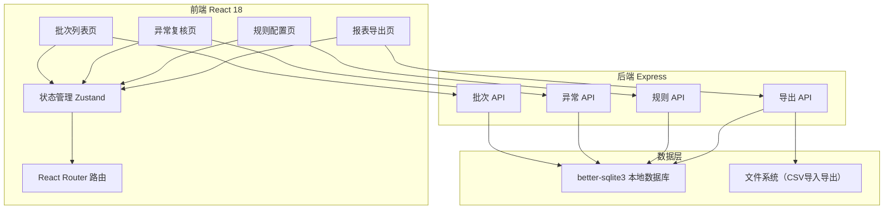
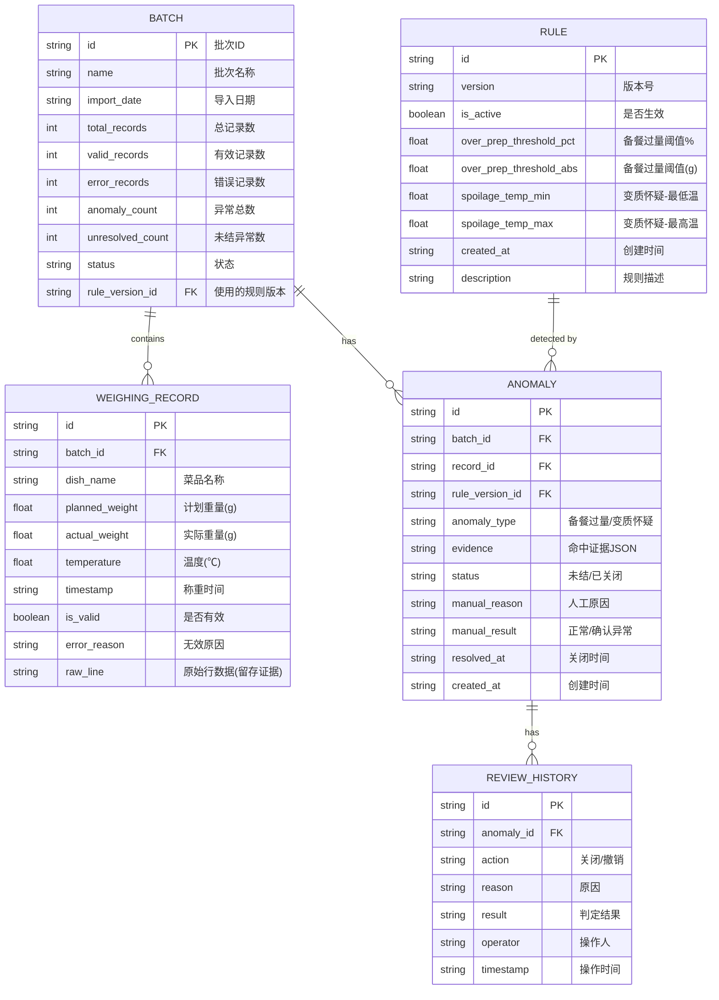

## 1. 架构设计

## 2. 技术描述
- 前端：React 18 + TypeScript + Vite + Tailwind CSS 3 + Zustand + Lucide React
- 后端：Express 4 + TypeScript + better-sqlite3（同步SQLite，本地应用无需额外数据库服务）
- 初始化工具：vite-init（react-express-ts 模板）
- 数据持久化：SQLite 本地文件 `data/canteen.db`，重启自动加载
- 文件处理：csv-parse（导入），原生 fs + 字符串拼接（导出 CSV）

## 3. 路由定义
| 前端路由 | 页面组件 | 用途 |
|----------|----------|------|
| / | 重定向到 /batches | 首页跳转 |
| /batches | BatchList | 批次列表、导入入口 |
| /batches/:id | ReviewList | 指定批次的异常复核列表 |
| /rules | RuleConfig | 损耗规则配置 |
| /export | ReportExport | 报表导出 |

| 后端 API | Method | 用途 |
|----------|--------|------|
| /api/batches | GET | 获取所有批次列表 |
| /api/batches | POST | 导入新批次（multipart/form-data 上传 CSV） |
| /api/batches/sample | POST | 导入预置样例批次 |
| /api/batches/:id | GET | 获取批次详情（含统计） |
| /api/anomalies | GET | 按批次/状态获取异常列表 |
| /api/anomalies/:id | GET | 获取异常详情（含规则证据） |
| /api/anomalies/:id/resolve | POST | 人工改判关闭异常 |
| /api/anomalies/:id/reopen | POST | 撤销关闭，恢复未结 |
| /api/rules | GET | 获取规则列表（含历史版本） |
| /api/rules | POST | 创建新版本规则 |
| /api/rules/:id/activate | POST | 激活指定规则版本 |
| /api/export/summary | GET | 导出批次汇总 CSV |
| /api/export/detail | GET | 导出批次明细 CSV |
| /api/consistency/check | GET | 数据一致性校验接口 |

## 4. 数据模型

## 5. 失败链路设计

1. **负数重量处理**：导入时检测 `actual_weight <= 0` 的行，标记 `is_valid=false`，记录 `error_reason="负数重量"`，保留 `raw_line`，不参与规则判定，但计入批次统计
2. **重复批次导入**：POST `/api/batches` 时检查批次ID是否已存在，返回 409 错误，前端提示"该批次已导入"
3. **关闭后撤销**：`ANOMALY.status` 支持 `unresolved → resolved → unresolved` 流转，每次操作写入 `REVIEW_HISTORY`，保留完整审计轨迹
4. **错误行不影响可用数据**：导入采用逐行校验策略，单行失败不阻断其他行，批次最终状态反映有效/错误数量
5. **规则证据留存**：每条异常的 `evidence` 字段存储完整 JSON（命中的规则ID、阈值、实际值、计算公式），规则版本删除时级联不清理证据
